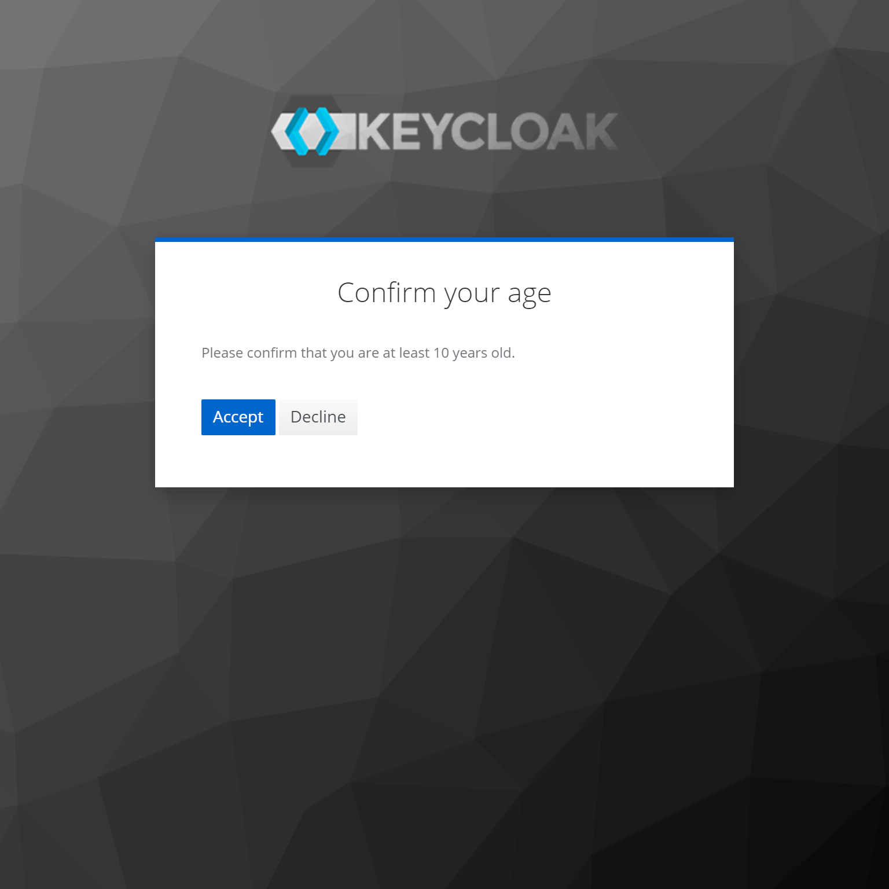
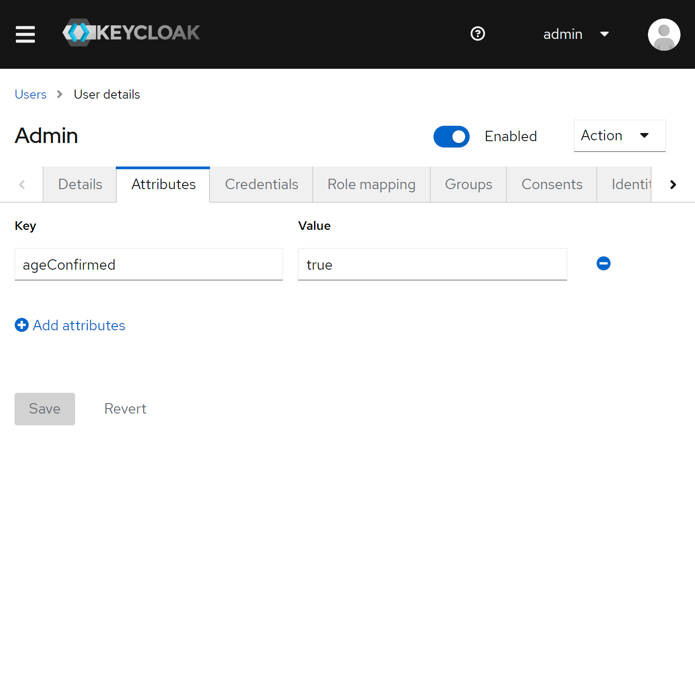

# Keycloak Age Confirmation Required Action

This extension adds a required action to enforce the user to confirm
a minimum age. By default the action asks the user to confirm that they
are at least 18 years old. If they deny the age confirmation the 
authentication flow is aborted. A common reason for this extension 
is to enforce some sort of age compliance.

**Features**

* require a user to confirm a minimum age (default 18)
* only allow login the user confirms the prompt
* abort the authentication if user denies the prompt
* configure a custom age via configuration
* storing the confirmation as a user attribute
* support for english and german localization
* force an update by assigning the required action to a user via the admin console

## Configuration

You can configure the minimum age the action should enforce. This is via the 
provider configuration you can provide as a CLI command or via the `keycloak.conf`:

```shell
--spi-required-action-age-confirmation-minimum-age=10
```

### Screenshots

#### Age Confirmation Prompt


#### User Attribute in Admin Console

